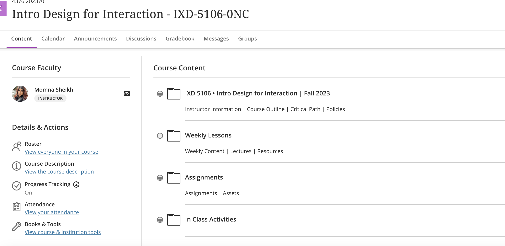

# ixd5106
Created a repo to store files from ixd5106

This is the subject for designing used in applications and websites..

## Course Outline
<https://learn.humber.ca/ultra/courses/_233665_1/outline>

## Info
This the subject where we are learning praticle implementation for designing and the subject code is ixd5106. The instructor name is Momna Sheikh.